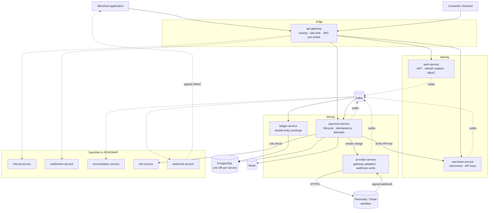
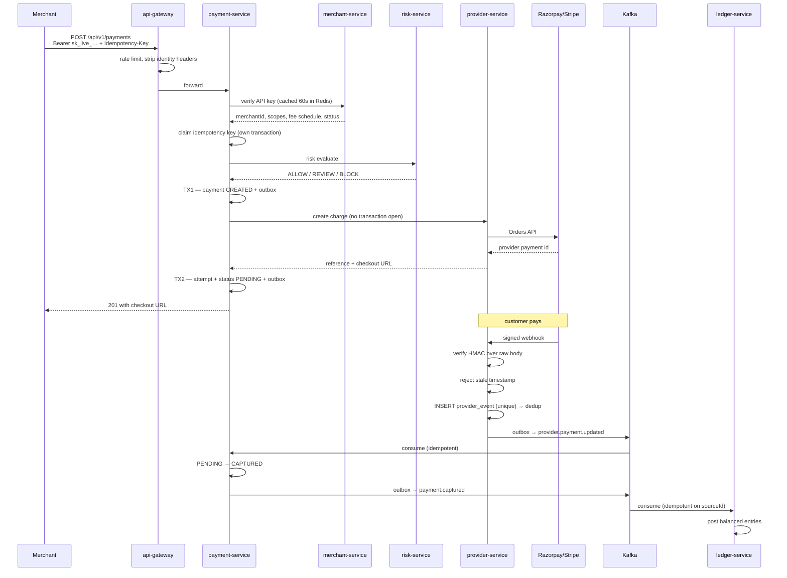
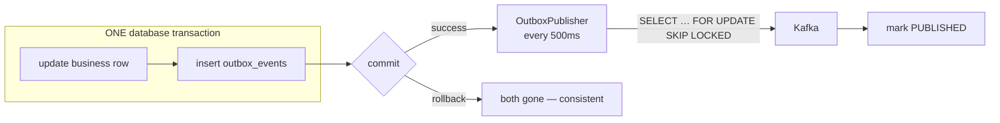

# PayFlow

A microservices payment platform — the parts of Stripe/Razorpay that are actually
hard: idempotency, the transactional outbox, a double-entry ledger, provider
webhook verification, and refund concurrency.

> **Status.** Seven modules are built and documented below. Eight further services
> (refund, settlement, reconciliation, risk, webhook, customer, notification,
> audit) are specified in [`docs/ROADMAP.md`](docs/ROADMAP.md) with the exact
> patterns to follow — the contracts they plug into already exist here.

---

## Why this exists

Most "payment gateway" projects are CRUD with a `status` column. The interesting
problems in payments are not endpoints; they are the failure modes:

- A merchant's HTTP call times out. Did the charge happen? They retry. Does the
  customer get billed twice?
- The provider sends the same `payment.captured` webhook five times. Does the
  merchant get credited five times?
- Two refund requests for ₹700 arrive simultaneously against a ₹1000 payment.
  Do both succeed?
- The database commits but the Kafka publish fails. Does the ledger silently
  diverge from reality?

Every one of those has an explicit, tested answer here.

---

## Architecture



### What is built

| Module | Port | Responsibility |
|---|---|---|
| `payflow-common` | — | Shared kernel: errors, money, correlation IDs, outbox, tenant guard, API-key/JWT filters |
| `api-gateway` | 8080 | Routing, Redis rate limiting, JWT pre-check, security headers, circuit breakers |
| `auth-service` | 8081 | Users, JWT, rotating refresh tokens with reuse detection, permission-based RBAC |
| `merchant-service` | 8082 | Merchant lifecycle, TEST/LIVE API keys, key verification for other services |
| `payment-service` | 8085 | Payment lifecycle, payment attempts, idempotency, risk gate, outbox |
| `provider-service` | 8086 | `PaymentGateway` abstraction, sandbox + Razorpay adapters, webhook verification and dedup |
| `ledger-service` | 8088 | Double-entry accounts, postings, entries, reversals, integrity job |

---

## The five decisions that matter

### 1. Idempotency is a database constraint, not a cache lookup

`UNIQUE (merchant_id, idempotency_key)`. Concurrent retries race to `INSERT`;
exactly one wins, the losers read the winner's stored response.

The claim commits in its **own** transaction (`REQUIRES_NEW`) *before* the
business work starts. If it shared the caller's transaction, a rollback would
erase the claim and a concurrent retry could create a second payment.

Reusing a key with a *different* body returns `409 IDEMPOTENCY_KEY_REUSED` rather
than replaying the wrong object — that is a merchant integration bug and it
should fail loudly.

`IdempotencyIT` proves this with 12 threads against real PostgreSQL: exactly one
acquires.

### 2. Remote calls never happen inside a database transaction

```
TX1   persist payment CREATED + outbox payment.created     commit
---   call provider-service                                no transaction
TX2   persist attempt + provider ref + status + outbox     commit
```

Holding a Hikari connection across a third-party network round trip means that
under provider latency the pool exhausts and takes down every unrelated payment.
`leak-detection-threshold: 15000` fires if anyone reintroduces the mistake.

This is also why the transactional writes live in `PaymentWriter`, a separate
bean: calling `this.persistNewPayment(...)` from `PaymentService` would bypass
Spring's proxy and silently disable `@Transactional`.

### 3. A provider timeout is not a decline

If the provider call times out, PayFlow records a failed *attempt* but leaves the
*payment* non-terminal. The provider may well have created the charge before our
socket gave up. Marking it `FAILED` would tell the merchant "no money moved"
while the customer's card was charged — the worst available outcome.
Reconciliation resolves the true state.

Relatedly: there is deliberately **no retry** on provider charge creation.
Retrying a charge that may already have succeeded is how customers get billed
twice. The retry decision belongs to the merchant, who holds the Idempotency-Key.

### 4. The ledger cannot be unbalanced, even by direct SQL

A ₹1000 payment with a ₹20 fee:

| Account | Debit | Credit |
|---|---:|---:|
| Payment Clearing (asset) | 1000.00 | |
| Merchant Payable (liability) | | 980.00 |
| Fee Revenue (revenue) | | 20.00 |
| | **1000.00** | **1000.00** |

The merchant is credited the **net**. Crediting 1000 and clawing back 20 means
any crash between the two leaves the merchant over-credited.

Enforcement is layered:
- `LedgerService` rejects unbalanced postings before writing anything
- `CHECK (total_debit = total_credit)` in PostgreSQL
- A trigger that raises on `UPDATE`/`DELETE` of `ledger_entries` — entries are
  immutable, corrections are reversing postings
- `LedgerIntegrityJob` re-proves global balance every 10 minutes and alerts

There is **no balance column anywhere**. Balances are derived by summing entries,
because a stored balance can drift from the entries that produced it.

### 5. Nothing trusts the client

- Browser "payment successful" is a claim from an untrusted party. Only a
  signature-verified provider webhook changes payment state.
- Webhook HMAC is computed over the **raw** body — parsing and re-serialising
  changes the bytes and breaks every signature.
- Signature valid but timestamp old → rejected. That is what stops replay.
- `merchantId`, fees and status are derived from the authenticated key, never
  accepted from the request body (mass-assignment defence).
- Cross-tenant reads return **404, not 403** — confirming an ID exists but
  belongs to someone else is itself a leak.
- Publishable (`pk_`) keys are rejected outright on money-moving endpoints.

---

## Payment flow



## QR / UPI payments

A merchant creates a QR payment by sending `paymentMethod: "QR"` to
`POST /api/v1/payments`. The provider generates a **single-use, fixed-amount**
UPI QR and PayFlow returns it in the payment response:

```jsonc
{
  "paymentReference": "pay_…",
  "status": "PENDING",
  "qrCode": {
    "data":  "upi://pay?pa=payflow.sandbox@upi&pn=PayFlow+Sandbox&am=250.00&cu=INR&tr=pay_…",
    "image": "data:image/png;base64,iVBORw0KGgo…"   // render directly in an 
  }
}
```

- `data` is the scannable payload — a `upi://pay` intent whose payee VPA, payee
  name and **amount are fixed by PayFlow**, so the customer cannot alter what they
  pay; `tr` ties the scan back to the specific payment.
- `image` is a rendered PNG (a `data:` URI in the sandbox, a provider-hosted image
  URL for Razorpay QR) — no extra round trip to display it.

Completion is identical to every other method: the payment stays `PENDING` until a
**signature-verified provider webhook** reports the scan was paid, at which point it
moves `PENDING → CAPTURED`. Nothing about "the customer scanned it" is trusted from
the client. The sandbox gateway renders the QR itself (ZXing); the Razorpay adapter
calls the QR Codes API (`/v1/payments/qr_codes`, `type: upi_qr`).

## Transactional outbox



`save-then-publish` is not equivalent: a crash between the two loses the event
forever, and the ledger silently diverges from the payments table.

`SKIP LOCKED` lets several publisher replicas drain concurrently without handing
the same row to two of them. Delivery is **at-least-once** by design — a crash
between the Kafka ack and the status update republishes — which is exactly why
every consumer is idempotent.

`payflow.outbox.pending` is gauged, alerted on, and wired into readiness.

## Refund concurrency

Two ₹700 refunds against a ₹1000 payment. Three independent defences:

1. `findByReferenceForUpdate` takes a **pessimistic row lock**, so the second
   request blocks and then sees the first one's committed `refundedAmount`
2. `Payment.registerRefund` enforces the invariant inside the aggregate, so no
   caller can bypass it
3. `CHECK (refunded_amount <= amount)` in PostgreSQL as the final backstop

The `@Version` column additionally catches lost updates on any path that reads
without the lock.

---

## Running it

```bash
cp .env.example .env
# generate real secrets — the services refuse to start on placeholder values
sed -i "s|CHANGE_ME_openssl_rand_base64_64|$(openssl rand -base64 64 | tr -d '\n')|" .env
sed -i "s|CHANGE_ME_openssl_rand_base64_32|$(openssl rand -base64 32 | tr -d '\n')|g" .env

# set the first platform admin (created only on an empty database)
printf 'PAYFLOW_ADMIN_EMAIL=admin@payflow.local\nPAYFLOW_ADMIN_PASSWORD=%s\n' \
  "$(openssl rand -base64 18)" >> .env

docker compose up -d postgres redis kafka          # infrastructure first
docker compose up -d --build                       # then the services

docker compose ps                                  # all should be healthy
```

`auth-service` creates the `PAYFLOW_ADMIN` from those two variables on first boot
and never touches it again. There is deliberately no seeded admin password in a
Flyway migration — that would put an identical known credential in every
deployment of this repository.

| Surface | URL |
|---|---|
| API gateway | http://localhost:8000 |
| Swagger (payment-service) | http://localhost:8085/swagger-ui.html |
| Kafka UI | http://localhost:8090 |
| Prometheus | http://localhost:9090 |
| Grafana | http://localhost:3000 |

End-to-end check:

```bash
PAYFLOW_INTERNAL_TOKEN=… SEED_ADMIN_PASSWORD=… \
  ./infrastructure/scripts/smoke-test.sh
```

It asserts the two properties that matter: a retried request with the same
Idempotency-Key does not create a second payment, and a duplicate provider
webhook does not post to the ledger twice.

### Build and test

```bash
mvn clean verify                 # unit + Testcontainers integration tests
mvn test -pl ledger-service      # one module
```

Integration tests need a running Docker daemon (Testcontainers). They use real
PostgreSQL, because the guarantees under test come from database constraints —
an H2 or mocked test would prove nothing.

---

## Data ownership

One database per service. **No service ever queries another's tables.** Cross-service
data moves by REST (when a synchronous answer is required) or Kafka (when it is not).

| Service | Database | Owns |
|---|---|---|
| auth-service | `auth_db` | users, roles, refresh tokens |
| merchant-service | `merchant_db` | merchants, API keys |
| payment-service | `payment_db` | payments, attempts, idempotency records |
| provider-service | `provider_db` | provider events |
| ledger-service | `ledger_db` | accounts, postings, entries |

Every service runs Flyway with `ddl-auto: validate`. Hibernate never touches the
schema; it only verifies its mapping matches what Flyway built. CI rejects edits
to already-applied migrations.

## Security

| Threat | Defence |
|---|---|
| Stolen database | API key secrets are BCrypt-hashed with a separate peppered SHA-256 for lookup; refresh tokens stored as SHA-256 only |
| Credential stuffing | Per-IP rate limiting at the gateway, account lockout after 5 failures |
| Refresh token theft | Rotation with reuse detection — presenting a rotated token revokes the whole family |
| IDOR / cross-tenant | `TenantGuard`, tenant-scoped queries, 404-not-403 |
| Webhook forgery | HMAC over raw body, constant-time comparison |
| Webhook replay | Timestamp window + unique `(provider, provider_event_id)` |
| Mass assignment | Request DTOs carry no merchant, fee or status fields |
| Enumeration | Random public references (`pay_…`), never sequential IDs |
| Internal endpoint exposure | Gateway 404s `/internal/**`; services require `X-Internal-Token` |
| Card data | Never stored. Provider tokens and last-4 only; a CHECK constraint rejects anything longer |

Secrets come from the environment only. `auth-service` refuses to start if
`JWT_SECRET` is absent or under 64 bytes.

## Observability

Every service exposes `/actuator/health`, `/actuator/prometheus`, and structured
logs carrying a correlation ID that survives gateway → service → Kafka → consumer.

Alerts in `infrastructure/prometheus/alert-rules.yml`:

- payment failure rate above 10%
- outbox backlog above 500 (events not reaching Kafka)
- **any** rejected unbalanced ledger posting — critical, always
- circuit breaker open

---

## Repository layout

```
payflow/
├── payflow-common/          shared kernel + Spring auto-configuration
├── api-gateway/             Spring Cloud Gateway
├── auth-service/            identity
├── merchant-service/        merchants + API keys
├── payment-service/         payment lifecycle
├── provider-service/        gateway adapters + webhooks
├── ledger-service/          double-entry ledger
├── infrastructure/
│   ├── prometheus/          scrape config + alert rules
│   ├── grafana/             datasource provisioning
│   └── scripts/             DB init, smoke test
├── docs/ROADMAP.md          the eight remaining services, specified
├── .github/workflows/ci.yml build, test, scan, image build, migration check
└── docker-compose.yml
```


# ============ PayFlow — fix and start (PowerShell, run from the repo root) ============

# --- 1. Fix the Dockerfiles: the parent pom declares all 7 modules, so every
#        build needs every module pom present, not just its own.
$services = [ordered]@{ 'api-gateway'=8080; 'auth-service'=8081; 'merchant-service'=8082;
                        'payment-service'=8085; 'provider-service'=8086; 'ledger-service'=8088 }
$modules  = 'payflow-common','api-gateway','auth-service','merchant-service',
            'payment-service','provider-service','ledger-service'

foreach ($svc in $services.Keys) {
  $port = $services[$svc]
  $poms = ($modules | ForEach-Object { "COPY $_/pom.xml $_/" }) -join "`n"
  $df = @"
# syntax=docker/dockerfile:1
# Build context is the repository ROOT:  docker build -f $svc/Dockerfile .
FROM maven:3.9-eclipse-temurin-21 AS build
WORKDIR /build

# The reactor parent lists every module, so Maven needs all the poms even when
# building a single service. Copying poms before src keeps the dep layer cached.
COPY pom.xml .
$poms
RUN mvn -B -q -pl payflow-common,$svc -am dependency:go-offline -DskipTests || true

COPY payflow-common/src payflow-common/src
COPY $svc/src $svc/src
RUN mvn -B -pl $svc -am clean package -DskipTests

FROM eclipse-temurin:21-jre-alpine AS runtime
RUN apk add --no-cache wget curl tzdata && addgroup -S payflow && adduser -S payflow -G payflow
WORKDIR /app
COPY --from=build /build/$svc/target/*.jar app.jar
RUN chown -R payflow:payflow /app
USER payflow
ENV TZ=UTC
EXPOSE $port
HEALTHCHECK --interval=15s --timeout=5s --start-period=90s --retries=6 \
  CMD wget -qO- http://localhost:$port/actuator/health/liveness || exit 1
ENTRYPOINT ["sh","-c","exec java `$JAVA_TOOL_OPTIONS -XX:+ExitOnOutOfMemoryError -Duser.timezone=UTC -jar /app/app.jar"]
"@
  [IO.File]::WriteAllText((Join-Path $PWD "$svc\Dockerfile"), ($df -replace "`r`n","`n"))
}
Write-Host "Dockerfiles fixed" -ForegroundColor Green

# --- 2. Generate .env (no openssl needed)
function New-Secret([int]$bytes) {
  $b = New-Object byte[] $bytes
  [Security.Cryptography.RandomNumberGenerator]::Create().GetBytes($b)
  ([Convert]::ToBase64String($b) -replace '[^A-Za-z0-9]','')
}
@"
POSTGRES_USER=payflow
POSTGRES_PASSWORD=$(New-Secret 24)
REDIS_PASSWORD=$(New-Secret 24)
JWT_SECRET=$(New-Secret 96)
API_KEY_PEPPER=$(New-Secret 32)
PAYFLOW_INTERNAL_TOKEN=$(New-Secret 32)
GRAFANA_ADMIN_PASSWORD=$(New-Secret 16)
PAYFLOW_ADMIN_EMAIL=admin@payflow.local
PAYFLOW_ADMIN_PASSWORD=$(New-Secret 18)
RAZORPAY_KEY_ID=
RAZORPAY_KEY_SECRET=
RAZORPAY_WEBHOOK_SECRET=
STRIPE_SECRET_KEY=
STRIPE_WEBHOOK_SECRET=
"@ -replace "`r`n","`n" | ForEach-Object { [IO.File]::WriteAllText((Join-Path $PWD ".env"), $_) }
Write-Host ".env written" -ForegroundColor Green

# --- 3. Shell scripts mounted into Linux containers must have LF endings
Get-ChildItem infrastructure\scripts\*.sh | ForEach-Object {
  [IO.File]::WriteAllText($_.FullName, ((Get-Content $_.FullName -Raw) -replace "`r`n","`n"))
}

# --- 4. Port 6379 is already taken on this machine -> publish Redis on 6380 instead
#        (containers still talk to each other on 6379 over the internal network)
$c = Get-Content docker-compose.yml -Raw
$c = $c -replace '\["6379:6379"\]', '["6380:6379"]'
[IO.File]::WriteAllText((Join-Path $PWD "docker-compose.yml"), $c)

# --- 5. Clean start
docker compose down --remove-orphans
docker compose up -d postgres redis kafka
Start-Sleep -Seconds 25
docker compose up -d --build
docker compose ps

---

# GitHub Codespaces Deployment

PayFlow can also be run completely in **GitHub Codespaces**.

This is useful when Docker Desktop, Java, Maven, PostgreSQL, Redis, or Kafka
should not be installed directly on the developer's Windows machine.

The complete development environment runs remotely:

```text
Windows / Browser
       |
       v
GitHub Codespaces
       |
       v
Docker Engine
       |
       +-- API Gateway
       +-- Auth Service
       +-- Merchant Service
       +-- Payment Service
       +-- Provider Service
       +-- Ledger Service
       +-- PostgreSQL
       +-- Redis
       +-- Kafka
       +-- Kafka UI
       +-- Prometheus
       +-- Grafana
```

The backend has been successfully run and verified in GitHub Codespaces with
all core containers reporting healthy status.

---

## Codespaces Port Map

When running through Docker Compose in Codespaces:

| Component | Host Port | Purpose |
|---|---:|---|
| API Gateway | `8000` | Main public PayFlow entry point |
| Auth Service | `8081` | Authentication and JWT |
| Merchant Service | `8082` | Merchants and API keys |
| Payment Service | `8085` | Payment APIs and Swagger |
| Provider Service | `8086` | Payment provider integration |
| Ledger Service | `8088` | Double-entry accounting |
| PostgreSQL | `5433` | Database infrastructure |
| Redis | `6381` | Cache / rate limiting |
| Kafka | `9092` | Event broker |
| Kafka UI | `8090` | Kafka inspection UI |
| Prometheus | `9090` | Metrics |
| Grafana | `3000` | Monitoring dashboards |

In GitHub Codespaces, only port `8000` should normally be made **Public**.

Application service and infrastructure ports should remain private unless a
temporary demonstration requires direct access.

Especially keep these private:

```text
5433  PostgreSQL
6381  Redis
9092  Kafka
```

---

# Codespaces Environment Setup

From the repository root inside the Codespace, create `.env`.

A secure environment can be generated with:

```bash
cat > .env <<EOF
POSTGRES_USER=payflow
POSTGRES_PASSWORD=$(openssl rand -hex 24)

REDIS_PASSWORD=$(openssl rand -hex 24)

JWT_SECRET=$(openssl rand -hex 64)

API_KEY_PEPPER=$(openssl rand -hex 32)

PAYFLOW_INTERNAL_TOKEN=$(openssl rand -hex 32)

GRAFANA_ADMIN_PASSWORD=$(openssl rand -hex 16)

PAYFLOW_ADMIN_EMAIL=admin@payflow.local
PAYFLOW_ADMIN_PASSWORD=$(openssl rand -hex 16)

RAZORPAY_KEY_ID=
RAZORPAY_KEY_SECRET=
RAZORPAY_WEBHOOK_SECRET=

STRIPE_SECRET_KEY=
STRIPE_WEBHOOK_SECRET=
EOF
```

Check only the variable names:

```bash
cut -d= -f1 .env
```

Expected variables include:

```text
POSTGRES_USER
POSTGRES_PASSWORD
REDIS_PASSWORD
JWT_SECRET
API_KEY_PEPPER
PAYFLOW_INTERNAL_TOKEN
GRAFANA_ADMIN_PASSWORD
PAYFLOW_ADMIN_EMAIL
PAYFLOW_ADMIN_PASSWORD
RAZORPAY_KEY_ID
RAZORPAY_KEY_SECRET
RAZORPAY_WEBHOOK_SECRET
STRIPE_SECRET_KEY
STRIPE_WEBHOOK_SECRET
```

Never commit `.env`.

Recommended `.gitignore` entries:

```gitignore
.env
.env.*
!.env.example
**/target/
```

Real credentials and tokens should never be placed in the repository.

If any secret is accidentally exposed in a screenshot, Git commit, issue,
message, or public log, rotate that value before using the deployment again.

---

# Starting PayFlow in Codespaces

Start infrastructure first:

```bash
docker compose up -d postgres redis kafka
```

Check:

```bash
docker compose ps
```

Wait until PostgreSQL, Redis, and Kafka are healthy.

Then start and build the Spring Boot services:

```bash
docker compose up -d --build \
auth-service \
merchant-service \
provider-service \
payment-service \
ledger-service \
api-gateway
```

The first build can take several minutes because Maven dependencies and Docker
images must be downloaded.

When the command finishes, run:

```bash
docker compose ps
```

A successful deployment should look similar to:

```text
payflow-api-gateway        Up (...) (healthy)
payflow-auth-service       Up (...) (healthy)
payflow-merchant-service   Up (...) (healthy)
payflow-payment-service    Up (...) (healthy)
payflow-provider-service   Up (...) (healthy)
payflow-ledger-service     Up (...) (healthy)
payflow-postgres           Up (...) (healthy)
payflow-redis              Up (...) (healthy)
payflow-kafka              Up (...) (healthy)
```

This confirms that the core PayFlow backend is running.

---

# Verify PayFlow Health

Verify the API Gateway from inside Codespaces:

```bash
curl -i http://localhost:8000/actuator/health
```

Expected result:

```text
HTTP/1.1 200 OK
Content-Type: application/vnd.spring-boot.actuator.v3+json
```

with:

```json
{
  "status": "UP",
  "groups": [
    "liveness",
    "readiness"
  ]
}
```

This proves that the API Gateway is running and passing Spring Boot health
checks.

A successful Codespaces deployment has been verified with:

```json
{"status":"UP","groups":["liveness","readiness"]}
```

and all core Docker containers showing:

```text
healthy
```

---

# Public Codespaces API

In VS Code Codespaces:

```text
Ports
  |
  v
8000
  |
  v
Port Visibility
  |
  v
Public
```

GitHub provides a forwarded address similar to:

```text
https://YOUR-CODESPACE-NAME-8000.app.github.dev
```

The health endpoint becomes:

```text
https://YOUR-CODESPACE-NAME-8000.app.github.dev/actuator/health
```

Expected response:

```json
{
  "status": "UP",
  "groups": [
    "liveness",
    "readiness"
  ]
}
```

Opening only:

```text
https://YOUR-CODESPACE-NAME-8000.app.github.dev/
```

may display:

```text
Whitelabel Error Page
404 Not Found
```

This does **not** mean the deployment failed.

PayFlow is a backend-first payment platform and no controller is currently
mapped to the root `/` path.

The health endpoint and payment APIs are the correct surfaces for validating
the backend.

---

# How to Evaluate PayFlow

PayFlow is not primarily a customer-facing website.

It is a backend payment infrastructure project designed to demonstrate the
systems behind payment providers such as Stripe and Razorpay.

The project can be evaluated through several different surfaces.

```text
1. Docker container health
2. Spring Boot actuator health
3. Swagger / OpenAPI
4. QR / UPI payment creation
5. Payment lifecycle
6. Provider webhooks
7. Kafka events
8. Double-entry ledger
9. Prometheus metrics
10. Grafana dashboards
```

---

# Swagger UI

The Payment Service exposes Swagger/OpenAPI documentation.

Local URL:

```text
http://localhost:8085/swagger-ui.html
```

GitHub Codespaces URL:

```text
https://YOUR-CODESPACE-NAME-8085.app.github.dev/swagger-ui.html
```

Port `8085` can remain private when used from the same authenticated Codespace.

Swagger provides an interactive API interface for endpoints such as:

```text
POST /api/v1/payments

GET /api/v1/payments/{paymentReference}

GET /api/v1/payments

POST /api/v1/payments/{paymentReference}/cancel
```

The payment API requires authentication, which means opening a protected
endpoint without credentials may return a response similar to:

```json
{
  "code": "UNAUTHORIZED",
  "message": "Authentication required"
}
```

This is expected behaviour and confirms that authentication controls are active.

---

# QR / UPI Demo

One of the most visible PayFlow features is QR payment generation.

Create a payment with:

```json
{
  "amount": 250,
  "currency": "INR",
  "merchantOrderId": "order-1001",
  "description": "PayFlow QR Demo",
  "paymentMethod": "QR"
}
```

The payment response contains information similar to:

```json
{
  "paymentReference": "pay_xxxxx",
  "status": "PENDING",
  "qrCode": {
    "data": "upi://pay?pa=payflow.sandbox@upi&pn=PayFlow+Sandbox&am=250.00&cu=INR&tr=pay_xxxxx",
    "image": "data:image/png;base64,iVBORw0KGgo..."
  }
}
```

`qrCode.data` is the UPI payment intent.

`qrCode.image` is the QR image that a frontend can render.

The QR flow is:

```text
Merchant
   |
   | create QR payment
   v
Payment Service
   |
   v
Provider Service
   |
   v
Generate fixed amount QR
   |
   v
Payment = PENDING
   |
   v
Customer scans QR
   |
   v
Payment provider confirms transaction
   |
   v
Signed provider webhook
   |
   v
Provider Service
   |
   v
Kafka
   |
   v
Payment Service
   |
   v
PENDING -> CAPTURED
   |
   v
Kafka
   |
   v
Ledger Service
   |
   v
Balanced accounting entries
```

A browser or frontend saying that a payment completed is not trusted.

Only a verified provider event can move the payment into the captured state.

---

# End-to-End Smoke Test

PayFlow provides:

```text
infrastructure/scripts/smoke-test.sh
```

Load the current Codespaces `.env` values:

```bash
export PAYFLOW_INTERNAL_TOKEN="$(grep '^PAYFLOW_INTERNAL_TOKEN=' .env | cut -d= -f2-)"

export SEED_ADMIN_PASSWORD="$(grep '^PAYFLOW_ADMIN_PASSWORD=' .env | cut -d= -f2-)"

export SEED_ADMIN_EMAIL="$(grep '^PAYFLOW_ADMIN_EMAIL=' .env | cut -d= -f2-)"
```

Run:

```bash
GATEWAY=http://localhost:8000 \
PROVIDER=http://localhost:8086 \
LEDGER=http://localhost:8088 \
./infrastructure/scripts/smoke-test.sh
```

The smoke test exercises the complete backend flow:

```text
Platform admin login
        |
        v
Create merchant
        |
        v
Activate merchant
        |
        v
Create merchant / owner
        |
        v
Generate TEST API key
        |
        v
Create payment
        |
        v
Retry same payment
        |
        v
Verify idempotency
        |
        v
Provider webhook
        |
        v
Kafka event
        |
        v
Payment CAPTURED
        |
        v
Ledger posting
```

The important guarantees are:

```text
Same Idempotency-Key
        |
        v
No duplicate payment
```

and:

```text
Duplicate provider webhook
        |
        v
No duplicate ledger posting
```

For a ₹1000 transaction with a ₹20 platform fee:

```text
Customer payment       ₹1000
Platform fee             ₹20
Merchant payable        ₹980
```

and:

```text
Total debit  = ₹1000
Total credit = ₹1000
```

---

# Kafka UI

Kafka UI provides a visual way to inspect the event-driven part of PayFlow.

Start it with:

```bash
docker compose up -d kafka-ui
```

Open:

```text
http://localhost:8090
```

or from Codespaces:

```text
https://YOUR-CODESPACE-NAME-8090.app.github.dev
```

Kafka UI can be used to inspect:

```text
topics
partitions
messages
consumer groups
payment events
provider events
ledger events
```

This helps demonstrate how services communicate asynchronously.

---

# Prometheus

Start Prometheus:

```bash
docker compose up -d prometheus
```

Open:

```text
http://localhost:9090
```

Codespaces:

```text
https://YOUR-CODESPACE-NAME-9090.app.github.dev
```

Prometheus collects metrics from Spring Boot Actuator endpoints.

Examples include:

```text
HTTP request metrics
JVM metrics
database connection metrics
payment failure metrics
outbox backlog metrics
service health metrics
```

---

# Grafana

Start Grafana:

```bash
docker compose up -d grafana
```

Open:

```text
http://localhost:3000
```

Codespaces:

```text
https://YOUR-CODESPACE-NAME-3000.app.github.dev
```

Grafana provides dashboards for operational monitoring.

The administrator password comes from:

```text
GRAFANA_ADMIN_PASSWORD
```

inside `.env`.

---

# Start the Complete Monitoring Stack

Kafka UI, Prometheus, and Grafana are optional.

The core payment system can run without their user interfaces.

Start all three with:

```bash
docker compose up -d kafka-ui prometheus grafana
```

Then check:

```bash
docker compose ps
```

The complete development stack can contain:

```text
PostgreSQL
Redis
Kafka
Kafka UI
Prometheus
Grafana

API Gateway
Auth Service
Merchant Service
Payment Service
Provider Service
Ledger Service
```

---

# Useful Docker Commands

Check container status:

```bash
docker compose ps
```

View all logs:

```bash
docker compose logs -f
```

Payment Service logs:

```bash
docker compose logs --tail=200 payment-service
```

API Gateway logs:

```bash
docker compose logs --tail=200 api-gateway
```

Auth Service logs:

```bash
docker compose logs --tail=200 auth-service
```

Merchant Service logs:

```bash
docker compose logs --tail=200 merchant-service
```

Provider Service logs:

```bash
docker compose logs --tail=200 provider-service
```

Ledger Service logs:

```bash
docker compose logs --tail=200 ledger-service
```

PostgreSQL logs:

```bash
docker compose logs --tail=200 postgres
```

Redis logs:

```bash
docker compose logs --tail=200 redis
```

Kafka logs:

```bash
docker compose logs --tail=200 kafka
```

Restart one service:

```bash
docker compose restart payment-service
```

Rebuild one service:

```bash
docker compose up -d --build payment-service
```

Stop all containers but keep stored Docker volumes:

```bash
docker compose down
```

Start the infrastructure again:

```bash
docker compose up -d postgres redis kafka
```

Then start application services:

```bash
docker compose up -d \
auth-service \
merchant-service \
provider-service \
payment-service \
ledger-service \
api-gateway
```

Do not use:

```bash
docker compose down -v
```

unless the development database and Docker volumes should intentionally be
deleted.

The `-v` option removes Docker volumes and can erase PostgreSQL development data.

---

# Fast Verification Commands

After opening or restarting the Codespace, these commands provide a quick
verification:

```bash
docker compose ps
```

```bash
curl http://localhost:8000/actuator/health
```

Expected:

```json
{"status":"UP","groups":["liveness","readiness"]}
```

To test individual services:

```bash
curl http://localhost:8081/actuator/health
curl http://localhost:8082/actuator/health
curl http://localhost:8085/actuator/health
curl http://localhost:8086/actuator/health
curl http://localhost:8088/actuator/health
```

---

# What a Successful Deployment Looks Like

A healthy PayFlow deployment should show:

```text
api-gateway        healthy
auth-service       healthy
merchant-service   healthy
payment-service    healthy
provider-service   healthy
ledger-service     healthy
postgres           healthy
redis              healthy
kafka              healthy
```

and:

```bash
curl -i http://localhost:8000/actuator/health
```

should return:

```text
HTTP/1.1 200 OK
```

with:

```json
{
  "status": "UP",
  "groups": [
    "liveness",
    "readiness"
  ]
}
```

These checks have been successfully completed with this repository running in
GitHub Codespaces.

---

# How to Demonstrate PayFlow in an Interview

A useful demonstration sequence is:

```text
1. Explain the microservice architecture
        |
        v
2. Run docker compose ps
        |
        v
3. Show every service healthy
        |
        v
4. Open API Gateway /actuator/health
        |
        v
5. Open Payment Service Swagger
        |
        v
6. Authenticate / obtain TEST API key
        |
        v
7. Create a payment
        |
        v
8. Create a QR / UPI payment
        |
        v
9. Show generated QR
        |
        v
10. Show payment initially PENDING
        |
        v
11. Trigger sandbox/provider webhook
        |
        v
12. Show payment become CAPTURED
        |
        v
13. Open Kafka UI
        |
        v
14. Show the payment event
        |
        v
15. Show ledger posting
        |
        v
16. Show Prometheus / Grafana monitoring
```

This demonstrates much more than a CRUD API.

The important backend concepts shown are:

```text
Microservices
Spring Boot
API Gateway
JWT authentication
Merchant API keys
PostgreSQL
Redis
Kafka
Transactional outbox
Idempotency
Provider abstraction
Webhook verification
QR / UPI payments
Double-entry ledger
Docker Compose
Health checks
Prometheus
Grafana
GitHub Codespaces
```

---

# Current UI Scope

PayFlow is currently a **backend-first payment infrastructure platform**.

It does not currently include a complete React, Next.js, Angular, or other
customer-facing frontend application.

That is why opening the API Gateway root path `/` does not display a payment
dashboard.

The current visual/evaluation surfaces are:

```text
Swagger UI
Generated QR payment image
Kafka UI
Prometheus
Grafana
Spring Actuator health endpoints
GitHub Codespaces forwarded URLs
```

A future frontend can be built on top of the existing APIs.

Possible frontend screens include:

```text
Merchant Login
Merchant Dashboard
Create Payment
QR Checkout
Payment Status
Transaction History
Payment Details
API Key Management
Webhook Management
Ledger View
Settlement View
Analytics Dashboard
Monitoring Dashboard
```

The backend already provides the payment infrastructure required by such a
frontend.

---

# PayFlow Purpose in One View

```text
                           PAYFLOW

Merchant / Application
        |
        v
     API Gateway
        |
        +---------------------------+
        |                           |
        v                           v
Authentication                Merchant Management
        |                           |
        +-------------+-------------+
                      |
                      v
                Payment Service
                      |
         +------------+------------+
         |                         |
         v                         v
      Redis                 Provider Service
                                   |
                                   v
                          Sandbox / Razorpay
                                   |
                                   v
                             Signed Webhook
                                   |
                                   v
                                 Kafka
                                   |
                     +-------------+-------------+
                     |                           |
                     v                           v
               Payment State               Ledger Service
                                                |
                                                v
                                       Double Entry Ledger
```

The purpose of PayFlow is to demonstrate how a payment system remains correct
when networks, retries, third-party providers, concurrent requests, and
asynchronous event delivery can all fail.

The main goal is not simply to expose payment endpoints.

The main goal is to guarantee:

```text
No duplicate charges
No duplicate webhook processing
No silently lost Kafka events
No cross-merchant data leakage
No unbalanced financial ledger
No client-controlled payment success
No secrets stored in source code
```

That is the core of the project.
