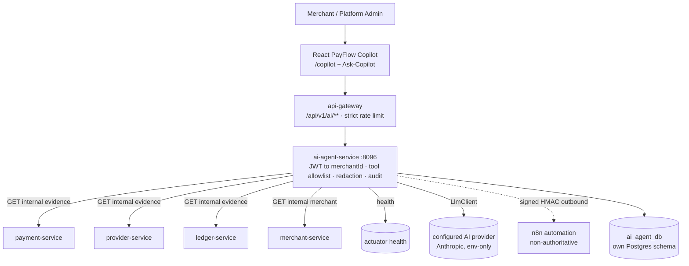

# PayFlow Copilot — Architecture & Implementation Spec

> Companion to [`payflow-ai-agent-current-state.md`](./payflow-ai-agent-current-state.md).
> Product name: **PayFlow Copilot**. Service: **`ai-agent-service`** (port **8096**).
> Core principle: **the LLM never determines financial truth** — it reasons only
> over verified, tool-retrieved evidence from payment / provider / ledger /
> merchant services, and clearly separates FACT from INFERENCE from
> MISSING EVIDENCE.

---

## 1. Design principle (non-negotiable)

```
user question → ai-agent-service → validated READ tool calls → deterministic
evidence aggregation (FACT / INFERENCE / MISSING) → LLM explanation
→ answer + evidence + confidence
```

The LLM **never**: guesses payment status, writes to any database, mutates the
ledger, invents evidence/IDs, or performs an unbounded action. All 17 existing
PayFlow architecture rules are preserved; the AI weakens none of them.

## 2. Architecture



The LLM is **not** in any payment critical path. If the provider/n8n/AI DB are
down, payment APIs are unaffected (ai-service failures are isolated).

## 3. Key decisions (grounded in the audit)

1. **Port 8096** (8095 reserved for planned `audit-service`).
2. **Java/Spring**, module `ai-agent-service`, package `com.payflow.ai`,
   depends on `payflow-common`. Own DB **`ai_agent_db`** (added to
   `init-databases.sh`; Render uses schema `ai` on the shared `payflow-db`).
3. **AuthN inside the service** reuses `payflow-common` `BearerJwtAuthenticationFilter`
   + `JwtTokenValidator`; `merchantId` comes from the verified JWT principal —
   never from the prompt/body. (Defense in depth on top of gateway header injection.)
4. **AuthZ**: new permissions `ai:use` (merchant Copilot) and `ai:admin`
   (platform-ops Copilot). Added to `auth-service` `Permission` enum + granted via
   new migration **`V5__ai_permissions.sql`**. (Roles are seed-only.)
5. **Three new narrow, read-only, `X-Internal-Token`-guarded evidence endpoints**
   are added to the owning services (the prompt sanctions this where a legitimate
   read is missing), each with tests, minimal fields, additive only:
   - `payment-service`: `GET /internal/payments/{ref}/evidence` → full investigation
     projection incl. `merchantId`, attempts, timestamps, provider, providerPaymentId,
     failure fields.
   - `provider-service`: `GET /internal/providers/events?provider=&providerPaymentId=`
     → stored `provider_events` evidence (PROCESSED rows), via new repo method
     `findByProviderAndProviderPaymentIdOrderByReceivedAtDesc`.
   - `ledger-service`: `GET /internal/ledger/postings/by-source/{sourceType}/{sourceId}`
     (+ entries) → exposes the existing `findBySourceTypeAndSourceId`.
   No existing financial logic is modified; no cross-service DB access is added.
6. **Tenancy is enforced by ai-agent-service** before any evidence is trusted
   as the merchant's: the payment evidence carries `merchantId`; the service
   asserts it equals the principal's merchantId (platform-admin with `ai:admin`
   may cross tenants). Cross-tenant → **404-style "not found"**, never
   "belongs to another merchant" (matches `TenantGuard` non-enumeration behaviour).
7. **LLM abstraction** `LlmClient.complete(AgentRequest) → AgentCompletion` with an
   Anthropic implementation. Config entirely from env; **if no key, the whole app
   still works** and AI endpoints return `503 AI_UNAVAILABLE` (a clean
   feature-unavailable response). No payment functionality depends on an LLM vendor.
8. **V1 is read-first.** No write/action tools. The approval data model is built
   (`ai_approvals`, statuses PENDING/APPROVED/REJECTED/EXPIRED/EXECUTED/FAILED) but
   no action executes in V1.
9. **ai-service is outbox-free in V1** (common outbox auto-config's package
   allow-list excludes `com.payflow.ai.*`; no domain events to publish). n8n
   alerts are outbound signed HTTP, not Kafka.

## 4. ai_agent_db schema (privacy-aware; migrations `V1`, `V2`)

- `ai_conversations(id, merchant_id NULLABLE, user_id, title, mode, status,
  created_at, updated_at)` — `merchant_id` null only for platform-admin context.
- `ai_messages(id, conversation_id, role, content, created_at)`.
- `ai_tool_executions(id, conversation_id, message_id, tool_name, status,
  latency_ms, created_at)` — **no secret tool outputs stored; references only.**
- `ai_approvals(id, conversation_id, requested_action, sanitized_params JSONB,
  requesting_user_id, merchant_id, required_permission, status, created_at,
  expires_at, approving_user_id, execution_result_ref)`.
- `ai_feedback(id, message_id, user_id, rating, comment, created_at)`.

**Never stored:** API-key secrets, provider secrets, JWTs, refresh tokens, DB
creds, PAN/CVV, raw infra credentials. Retention: `AI_CONVERSATION_RETENTION_DAYS`
(default 30) via a `@Scheduled` cleanup job.

## 5. Tool registry (V1 — all READ-ONLY)

Each tool: name · strict input schema · permission · tenant requirement · timeout ·
output schema · sensitivity · audit record. The model may call **only** these
(hardcoded allowlist; no arbitrary URL/SQL/shell).

| Tool | Backing call | Perm | Tenant |
|---|---|---|---|
| `get_current_merchant` | merchant `GET /internal/merchants/{id}` | ai:use | self |
| `get_payment` | payment `GET /internal/payments/{ref}/evidence` | ai:use | asserted |
| `list_payments` | payment `GET /api/v1/payments` (scoped) | ai:use | self |
| `get_payment_attempts` | from `get_payment` evidence | ai:use | asserted |
| `get_provider_evidence_summary` | provider `GET /internal/providers/events` | ai:use | asserted |
| `get_ledger_postings_for_payment` | ledger `by-source/PAYMENT/{ref}` | ai:use | asserted |
| `get_ledger_posting_entries` | ledger `postings/{id}/entries` | ai:use | asserted |
| `get_service_capability` | static capability map (implemented vs planned) | ai:use | n/a |
| `explain_idempotency_contract` | static, from real impl | ai:use | n/a |
| `get_gateway_health` | actuator health | **ai:admin** | platform |
| `get_service_health` | actuator health (per service) | **ai:admin** | platform |

Higher-level deterministic aggregator **`PaymentInvestigationService`**: input
`paymentReference` → merges the above into a structured result with
`facts[]` (type/value/source), `inferences[]`, `missingEvidence[]`, `warnings[]`,
`balanced`, correlation IDs. The LLM receives this structure; it never queries DBs.

## 6. Permission matrix

| Role | ai:use | ai:admin | Copilot capability |
|---|---|---|---|
| PAYFLOW_ADMIN | yes | yes | Merchant + Platform-Ops Copilot (health, cross-tenant investigation) |
| MERCHANT_OWNER | yes | - | Own-merchant investigation & explanations |
| MERCHANT_DEVELOPER | yes | - | Own-merchant + integration debugging |
| MERCHANT_FINANCE | yes | - | Own-merchant payment/ledger evidence |
| MERCHANT_SUPPORT | yes | - | Own-merchant read explanations |

## 7. API (gateway route `/api/v1/ai/**`, strict rate limit)

`POST /api/v1/ai/conversations`, `GET /conversations`, `GET /conversations/{id}`,
`POST /conversations/{id}/messages`, `GET /conversations/{id}/messages`,
`POST /conversations/{id}/stream` (**SSE**; streams only user-facing tokens + safe
tool-status, never chain-of-thought), `POST /feedback`, `GET /capabilities`
(works even when LLM disabled). Approval routes scaffolded: `GET /approvals`,
`POST /approvals/{id}/approve|reject`.

Response contract: `{ messageId, conversationId, answer, evidence[], confidence
(HIGH|MEDIUM|LOW|UNKNOWN, deterministic), warnings[], toolCalls[] }`.

## 8. Security controls (verified before merge)

Code-level deterministic redaction before any tool result reaches the LLM (mask
fields matching password/secret/token/authorization/cookie/apiKeySecret/
keySecret/webhookSecret/jwt/refreshToken/databaseUrl/connectionString/privateKey
+ `sk_`/`pk_` prefixes). Structured boundaries around retrieved data (treated as
untrusted; never concatenated into the system prompt). Versioned system prompt
(`prompt/`) with injection defences + prompt tests. No AI key in frontend/bundle;
no secret in git; no cross-tenant tool; no arbitrary HTTP/SQL/shell tool; no
key-secret retrieval tool; no LLM-directed DB write; no ledger mutation; no
browser/AI-authorized capture.

## 9. Observability / cost / rate limits

Micrometer: `payflow.ai.requests{,.success,.failure}`, `payflow.ai.latency`,
`payflow.ai.tool.calls{,.failures,.duration}`, `payflow.ai.approvals.pending`,
`payflow.ai.tokens.{input,output}`. Cost controls: `AI_MAX_TOOL_CALLS` (8),
`AI_MAX_HISTORY_MESSAGES` (30), max response tokens, `AI_REQUEST_TIMEOUT_SECONDS`
(45), per-user gateway rate limit (approx 15/min), optional daily tenant quota.
Gateway AI route uses a stricter limiter than normal reads.

## 10. n8n (automation layer, non-authoritative)

Signed (HMAC + timestamp/replay) outbound integration only; never authoritative
for capture/ledger/state/idempotency/webhook-verify/dedup. Env:
`N8N_ENABLED`, `N8N_WEBHOOK_BASE_URL`, `N8N_SHARED_SECRET`. Workflows exported to
`automation/n8n/` with a README: (1) incident alert, (2) daily ops summary (only
from real read endpoints; unavailable metrics marked unavailable), (3) deployment
health check, (4) unresolved-payment review (read-only; never changes status).

## 11. Environment variables

Server-only: `AI_AGENT_ENABLED`, `AI_PROVIDER=anthropic`, `AI_MODEL`,
`ANTHROPIC_API_KEY`, `AI_MAX_TOOL_CALLS`, `AI_MAX_HISTORY_MESSAGES`,
`AI_REQUEST_TIMEOUT_SECONDS`, `AI_CONVERSATION_RETENTION_DAYS`, `JWT_SECRET`,
`PAYFLOW_INTERNAL_TOKEN`, `N8N_*`, downstream `payflow.services.*-url`.
Frontend: only `VITE_API_URL` (public). **No AI secret is ever `VITE_*`.**

## 12. Build sequence (maps to the prompt's stages)

1. (done) Stage 0/1 — audit + this spec, feature branch `feat/payflow-ai-copilot`.
2. Service skeleton (pom module, app, application.yml, SecurityConfig, DB + `V1`/`V2`,
   `init-databases.sh`, Dockerfile, `/capabilities`) + build.
3. `LlmClient` abstraction + Anthropic impl + config + **redaction layer** + tests.
4. Tool registry (read-only allowlist) + the 3 narrow internal evidence endpoints
   in payment/provider/ledger (+ their tests).
5. `PaymentInvestigationService` (FACT/INFERENCE/MISSING aggregation) + tests.
6. Conversation API + SSE streaming.
7. Tenant/RBAC hardening + `V5__ai_permissions.sql` + gateway `/api/v1/ai/**`
   route & limiter.
8. React Copilot page/route/nav/service + evidence cards.
9. Payment-detail "Ask Copilot" contextual launch (resource resolved server-side).
10. n8n signed bridge. 11. n8n workflows exported. 12. Observability + rate limit +
    retention. 13. Unit/integration/security/prompt-injection tests. 14. Full
    regression (`mvn verify`, frontend build/test). 15. PR + CI. 16. Render/Vercel/
    Aiven inspection + config (no paid resources without approval). 17. Preview
    verification where possible. 18. Production only when explicitly approved.

## 13. Known blockers requiring a human (stated, not faked)

- `ANTHROPIC_API_KEY` is a runtime secret the user must supply; without it the AI
  endpoints return `AI_UNAVAILABLE` (everything else works).
- Render/Vercel/Aiven provisioning may incur cost → inspect-and-configure only;
  deploy requires explicit approval.
